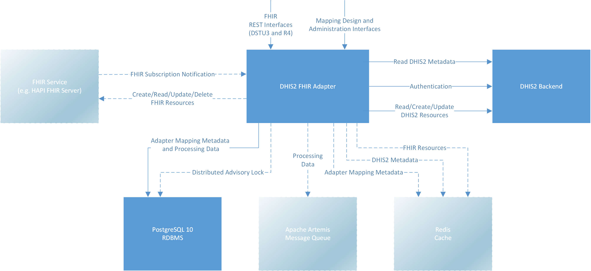

# DHIS2 FHIR Adapter
## Overview
This repository contains the source code of the DHIS2 FHIR Adapter. The initial scope of the Adapter 
 was the import of FHIR Resources into DHIS2 Tracker by using FHIR Subscriptions. This approach has been discussed on the [first integration workshop between DHIS2 and HL7-FHIR](http://sil-asia.org/sil-asia-dhis2-fhir-integration-meeting/).
 
A guide for a simple configuration and the use of the FHIR Interfaces can be found in this [YouTube Video](https://youtu.be/i7XFeBVpioM). This does not include the comprehensive features that are described below.

The import and export of clinical data works on the basis of a domain specific business rule engine that decides about transformations of patient related clinical data to questionnaire-like structures (DHIS2 Tracker Programs and their Program Stages). It is 
 optimized for national FHIR profiles that are based on standard coding systems like LOINC, SNOMED CT, CVX and others or even on national coding systems (e.g. national coding system for immunization). A specific DHIS 2 FHIR profile that allows the mapping of 
 all Tracker Program items is not yet available. Even if the standard configuration of the adapter contains just the rules to map a DHIS 2 Tracked Entity Type to a FHIR Patient, the adapter can also be configured to perform a mapping to a different FHIR 
 Resource (e.g. to FHIR Practitioner).



The image above shows the high level architecture of the DHIS2 FHIR Adapter. Optional components and connections are shown with dashed lines.

The Adapter receives FHIR subscription notifications from one or more FHIR Servers (e.g. HAPI FHIR JPA Server) when there are created or updated resources. The Adapter queues the notifications internally and retrieves new data from the FHIR Server as soon as 
 possible. The Adapter may retrieve more data from the FHIR Server when needed (e.g. FHIR organization resources). To perform transformations to DHIS2 there are configured rules and transformations. Rules and transformations may use reusable Javascript code 
 snippets. In order to identify already created DHIS2 tracked entity instances, a kind of national identifier must be provided by the FHIR patient resource (or any other FHIR resource that is mapped to a DHIS2 tracked entity type).
 
The Adapter uses a database to store mapping data and temporary processing data. In order to avoid conflicting tasks on more than one Adapter instance in a clustered environment (not required when just FHIR REST interfaces are used), locking is performed by 
 using PostgreSQL Advisory Locks. Since there may be more created and updated FHIR resources than the Adapter and the DHIS2 backend (depending on the hardware sizing) can process at the same time, the Adapter queues all FHIR notifications until it is able 
 to process them. The queue is also used to retry failed transformations (e.g. DHIS2 backend could not be reached). In a non-clustered environment the embedded Apache Artemis message queuing system can be used (not required when just FHIR REST interfaces are 
 used). In a clustered environment an external Apache Artemis message queuing system to which all Adapter instances are connected must be installed. The Adapter supports three different caches (Adapter mapping metadata to avoid database accesses, DHIS2 
 metadata to avoid DHIS2 backend accesses and FHIR resources to avoid accesses to FHIR endpoints of FHIR servers). Each of the three caches can be configured individually. The cache can be disabled, can be stored in memory (Caffeine cache implementation) or 
 on a caching server (Redis cache).
     
The rules that are used for the import are also used for the export of DHIS2 resources to a FHIR server. Also the FHIR REST interfaces provide the data based on these rules.
     
## Running the Adapter
### Dependent Software Components
#### DHIS2
DHIS 2.30 or newer must be installed.  

The application includes a suggested tracked entity type person. The corresponding metadata for DHIS 2.31 is located at [Person Attribute Metadata](fhir/src/main/resources/static/dhis/metadata/person-attribute-metadata.json) and 
[Person Metadata](fhir/src/main/resources/static/dhis/metadata/person-metadata.json). First the attribute metadata must be imported. If you want to create your own tracked entity type based on the imported attributes then the second file does not need to be
 imported. Not all created tracked entity attributes are included in the created tracked entity type person. Additional attributes can be added as needed. The files can also be accessed from the setup application that is described below. This allows also to 
 customize the mapping to the tracked entity type for the FHIR resource patient. Currently, the adapter supports text based, number based and date/time based tracked entity attributes.

#### FHIR Service
A FHIR Service that provides the FHIR Endpoints and also supports FHIR Subscriptions can ben used when needed. In this case the configuration of the Adapter must enable imports (see below). HAPI FHIR JPA Server Example 3.6.0 or later (in this case the 
 HAPI-FHIR Starter) can be used. Instructions on how to setup the FHIR Service can be found at http://hapifhir.io/doc_jpa.html.

The initial subscription for FHIR Resource Patient is created by the initial setup user interface that is described later in this document. 

Minimal requirements:
- Support of FHIR subscriptions (minimum REST hook subscriptions without a payload)
- Searches based on a last updated timestamp of the FHIR resource that is greater or equal than a specified timestamp and ordering for the last updated timestamp of the FHIR resource.
- Either paging when searching for large amount of data or returning as many entries that last update timestamps change in one result bundle.
                               
#### PostgreSQL Database
The Adapter requires a PostgresSQL 10.0 database. 

Create a non-privileged user called dhis-fhir by invoking:

    sudo -u postgres createuser -SDRP dhis-fhir                  

For development purpose enter dhis-fhir as password at the prompt. Create a database called dhis2-fhir by invoking:

    sudo -u postgres createdb -O dhis-fhir dhis2-fhir
    
Add the uuid extension to the created database by invoking:

    sudo -u postgres psql dhis2-fhir
    
Enter the following command into the console:

    CREATE EXTENSION "uuid-ossp";    
    
Exit the console and return to your previous user with \q followed by exit.

The database tables will be created on first startup of the Adapter automatically.    

### Downloading
The stable versioned release builds can be downloaded at [Releases](https://github.com/dhis2/dhis2-fhir-adapter/releases).

You can download the latest build of the Adapter at [Download WAR](https://s3-eu-west-1.amazonaws.com/releases.dhis2.org/fhir/dhis2-fhir-adapter.war). Alternatively you can also build the application from its source code as described below. Otherwise you 
can continue with the configuration section of this document.

### Building
In order to build the adapter Java Development Kit 8 and Maven 3.2 or later is required. No additional repositories need to be configured in Maven configuration. The following command builds the artifact dhis2-fhir-adapter.war in sub-directory app/target.

    mvn clean install

### Configuration
The application has its configuration directory below $DHIS2_HOME/services/fhir-adapter. This sub-directory structure must be created below $DHIS2_HOME and a configuration file named application.yml must be placed inside this directory. The Adapter may create 
 further sub-directories below this directory (e.g. directory containing message queue files). The environment variable DHIS2_HOME must have been set when running the Adapter application.

The following example contains the content of configuration file application.yml with default configuration values for a non-clustered environment without using import by FHIR subscriptions. These configuration values can be customized if needed.

```yaml
server:
  # The default port on which HTTP connections will be available when starting
  # the Adapter as a standalone application.
  port: 8081

spring:
  datasource:
    # The JDBC URL of the database in which the Adapter tables are located.
    url: jdbc:postgresql://localhost/dhis2-fhir
    # The username that is required to connect to the database.
    username: dhis-fhir
    # The password that is required to connect to the database.
    password: dhis-fhir

dhis2.fhir-adapter:
  # Configuration of DHIS2 endpoint that is accessed by the adapter.
  endpoint:
    # The base URL of the DHIS2 installation.
    url: http://localhost:8080
    # The API version that should be accessed on the DHIS2 installation.
    api-version: 30
    # Authentication data to access metadata on DHIS2 installation.
    # The complete metadata (organization units, tracked entity types, 
    # tracked entity attributes, tracker programs, tracker program stages) 
    # must be accessible.
    system-authentication:
      # The username that is used to connect to DHIS2 to access the metadata.
      username: admin
      # The password that is used to connect to DHIS2 to access the metadata.
      password: district
```

In order to enable support of import by FHIR subscriptions, the following items must be added to the resulting configuration file in a non-clustered environment.

```yaml
spring:
  # Settings of the Artemis message queueing system. For a non-clustered
  # installation the embedded client can be used where the data is stored
  # on the local file system.
  artemis:
    # Settings for the embedded client, that can be used for a non-clustered
    # installation.
    embedded:
      # Specifies of the embedded client should be enabled. If the adapter
      # runs in a clustered environment the embedded client must not be enabled
      # and host, port, username and password for the Artemis broker must be
      # specified.
      enabled: true

management:
  health:
    jms:
      # JMS health check can be enabled when Artemis queue is available.
      enabled: false

dhis2.fhir-adapter:
  # Specifies if the automatic import of FHIR resources to DHIS2 is enabled.
  import-enabled: true
```

More changeable settings can be found in the file [default-application.yml](app/src/main/resources/default-application.yml).

### Running
The adapter WAR can be run with a servlet container 3.1 or later (like Apache Tomcat 8.5 or Jetty 9.3). 
    
Since the created WAR file is an executable WAR file, also the following command can be entered in folder app/target in the console:

    java -jar dhis2-fhir-adapter.war    
        
With the default configuration the initial setup user interface can be accessed in any web browser by using `http://localhost:8081/setup`. The web browser will ask for a username and password of a DHIS2 user that has privilege F_SYSTEM_SETTING. 
After 
 successful authentication a setup form will be displayed with further instructions and examples. The initial setup can be made once only and the initial setup form will not be accessible anymore. 
 
After successful initial setup the FHIR REST interfaces are accessible under the following base URIs. Basic and OAuth2 authentication and authorization of DHIS 2 is supported.

| FHIR Version | Context relative URI |
|--------------|----------------------|
| DSTU3        | /fhir/dstu3/default  |
| R4           | /fhir/r4/default     |

### API for Administration and Mapping
The adapter provides REST interfaces for administration and mapping. The documentation is currently generated automatically when building the adapter. Unit test execution must not be skipped in this case when building the adapter. The documentation can be 
 found at docs/api-guide.html. If the Adapter has been started by command line without changing the port, then the guide is available at `http://localhost:8081/docs/api-guide.html`.
 
The JavaScript API that is used to create rules and transformations is generated automatically when running the adapter. The script can be found at scripts/to-dhis2-all-mapping.js. If the Adapter has been started by command line without changing the port, 
 then the guide is available at `http://localhost:8081/scripts/to-dhis2-all-mapping.js`. The FHIR resources are exposed to JavaScript by [HAPI FHIR 3.7.0](http://hapifhir.io/) objects. 
